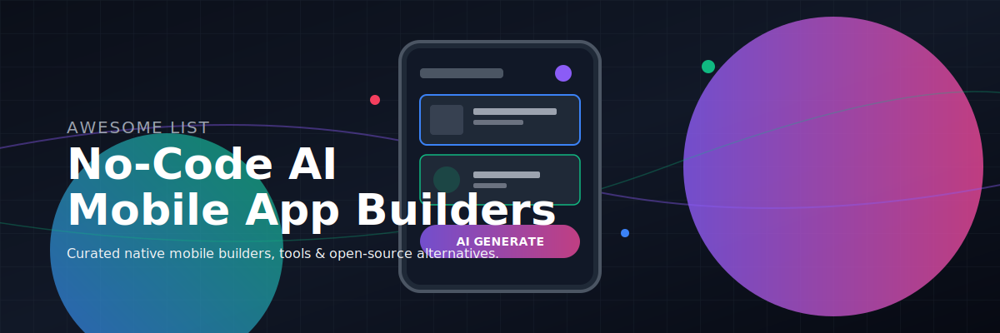

# Awesome No-Code AI Mobile App Builders 🚀

  

## 📱 Top No-Code AI Native Mobile App Builders Ecosystem

> A curated directory of the best **SaaS platforms**, **low-code tools**, and **open-source GitHub repositories** for AI-powered visual mobile app development and native iOS & Android deployment.

**Last updated: March 2026**

This repository tracks notable **SaaS platforms** and **open-source projects** for **No Code AI Native Mobile App Builders**. These tools enable users to build native iOS and Android apps using visual drag-and-drop interfaces, AI assistance, components, and natural language prompts without writing traditional code.

**Examples** include Adalo, GoodBarber, Thunkable, FlutterFlow, Choicely, and Draftbit (the category leaders). Tools listed here emphasize **native performance**, AI code generation, component libraries, backend integration, and one-click publishing to app stores.

**Open-source emphasis**: This section is heavily expanded with every major active project for self-hosting, local development, full customization, and complete code ownership — ideal for developers, startups, and organizations seeking cost-effective and sovereign mobile app building solutions.

Contributions welcome! Open a PR to add/update entries. Keep descriptions factual and link to official sites.

## 📋 Table of Contents
- [SaaS Products](#saas-products)
- [Open-Source GitHub Projects](#open-source-github-projects)
- [How to Contribute](#how-to-contribute)
- [Disclaimer](#disclaimer)

## 💼 SaaS Products

### 🚀 Core Platforms (No Code AI Native Mobile App Builders)

| Platform | Description | Free Tier / Limits | Pricing | Company Size (Est.) |
| :--- | :--- | :--- | :--- | :--- |
| **[FlutterFlow](https://flutterflow.io/)** | Visual builder for Flutter apps with AI assistance and high-performance native output. | **Yes** (Free Forever) • Max 2 active projects, 2 API endpoints • Lifetime limit of 5 AI generation requests • Cannot download code or publish to App Stores | Starts at **$39/month** (billed annually) or $49/month | **$25M – $33M ARR** / $75M+ Valuation |
| **[Adalo](https://www.adalo.com/)** | Popular no-code platform for building native mobile apps with database, logic, and AI-assisted design. | **Yes** (Free Forever) • Max 500 database records/app • Cannot publish to App Stores or custom domain • Adalo branding, 1 editor | Starts at **$36/month** (billed annually) or $45/month | **$24M ARR** / $180M+ Valuation |
| **[Thunkable](https://www.thunkable.com/)** | Powerful drag-and-drop platform with AI features and native component support. | **Yes** (Free Forever) • Max 3 public projects, 5 screens/project • 100 MB account storage • Cannot publish to App Stores | Starts at **$23-$39/month** | **$10.4M ARR** |
| **[GoodBarber](https://www.goodbarber.com/)** | Feature-rich no-code builder focused on beautiful native apps for e-commerce and content. | **No** (30-day free trial only) | Content apps start at **$25-$30/month**; E-commerce apps start at **$40/month** | **$5M – $5.6M ARR** / $15M Valuation |
| **[Choicely](https://www.choicely.com/)** | No-code platform specializing in engaging mobile apps with strong AI capabilities. | **Yes** (Free Forever) • Max 50 daily credits (max 300 credits/month) • Cannot publish or scale without upgrading | Premium starts at **$25/month** (billed annually); Business starts at **$50/month** | **$2.7M ARR** |
| **[Draftbit](https://draftbit.com/)** | Visual builder that exports clean React Native code for native iOS and Android apps. | **Yes** (Free Forever) • Max 3 projects • One-time 5,000 credits for AI building • Cannot publish to App Stores or export source code | Standard starts at **$12/month** (billed annually); Pro starts at **$24/month** | **$2.6M ARR** / $7.7M Valuation |

### 🛠️ Advanced & Specialized Platforms

**Other notable mentions**: Glide 📱, Bubble 🫧 (with mobile), and various AI-enhanced no-code mobile tools.

## 🔓 Open-Source GitHub Projects

### 🤖 Dedicated No Code / Low Code AI Native Mobile App Builders

- **[Langflow](https://github.com/langflow-ai/langflow)**   
  Visual no-code/low-code environment for building AI-powered applications with mobile deployment potential. 🛠️

- **[Dify](https://github.com/langgenius/dify)**   
  Open-source AI application builder with visual workflows that can be extended to mobile apps. 🚀

- **[Godot Engine](https://github.com/godotengine/godot)**   
  Open-source engine with strong 2D/3D mobile export capabilities and visual scripting. 🎮

- **[NocoDB](https://github.com/nocodb/nocodb)**   
  Open-source Airtable alternative that can power no-code mobile app backends with REST/GraphQL APIs. 📊

- **[Odoo](https://github.com/odoo/odoo)**   
  Open-source business applications suites, with mobile extensions for no-code business apps. 💼

- **[Ionic Framework](https://github.com/ionic-team/ionic)**   
  Open-source SDK for building high-performance mobile apps. ⚡

- **[Appsmith](https://github.com/appsmithorg/appsmith)**   
  Open-source low-code framework for building custom internal tools and mobile web apps with JavaScript extensibility. 🛠️

- **[Directus](https://github.com/directus/directus)**   
  Open-source headless CMS that powers custom mobile apps through APIs and visual interfaces. 🔗

- **[Tooljet](https://github.com/ToolJet/ToolJet)**   
  Open-source low-code platform for building internal tools and mobile-friendly applications. ⚙️

- **[Budibase](https://github.com/Budibase/budibase)**   
  Open-source low-code platform with mobile-responsive apps and PWA capabilities that can be wrapped into native apps. 📦

- **[Framework7](https://github.com/framework7io/framework7)**   
  Open-source mobile UI framework for building native-looking apps. 🎨

- **[Capacitor](https://github.com/ionic-team/capacitor)**   
  Open-source native runtime for web apps to run as native mobile apps. 🔌

- **[Saltcorn](https://github.com/saltcorn/saltcorn)**   
  Open-source no-code platform for building database-driven web and mobile applications. 💾

- **[MIT App Inventor](https://github.com/mit-cml/appinventor-sources)**   
  Classic open-source no-code platform for building fully functional native Android apps using visual blocks and AI extensions. 🎓

### 👥 Additional Community Options & Resources

- **[FlutterFlow Open Alternatives](https://github.com/search?q=flutterflow+open+source)** — Community-driven open-source visual builders and code generators for Flutter-based native apps. 💻
- Many community **Flutter** + **AI code gen** templates for visual-like development. 🤖

**Frameworks for building custom builders**: Combine **MIT App Inventor**, **Budibase**, **Tooljet**, **Appsmith**, and **Flutter** with **Ollama** and **LangGraph** for fully local, AI-powered no-code native mobile app development. 🛠️

## 🤝 How to Contribute

1. Fork the repo. 🍴
2. Add/edit entries in `README.md` (follow existing format). ✍️
3. Include: name, link, 1–2 sentence description, and whether it's SaaS or open-source. 📝
4. Submit PR with a short explanation. 🚀

Star the repo if you find it useful! ⭐

## ⚠️ Disclaimer

- This is a **community-curated** list — not exhaustive and not an endorsement.
- No-code tools vary in native performance and scalability. Complex apps may benefit from hybrid approaches.
- Self-hosted open-source solutions require technical setup and maintenance for mobile deployment.

---

**Made for citizen developers, startups, agencies, and mobile app creators.** 🚀  
Let's make native mobile app building more accessible, intelligent, and fully controllable. 🌟
